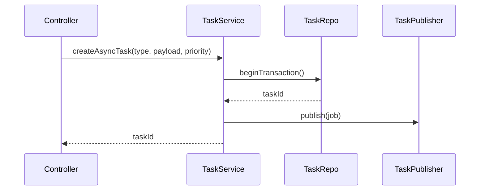

# Refactor da API AST (HTTP + TaskService)

## Objetivos

- Substituir gRPC + TaskManager em memória por HTTP REST + persistência durável.
- Entregar respostas `202 Accepted` com `taskId` para operações assíncronas.
- Expor endpoints de consulta (polling) e opcionalmente streaming SSE.

## Módulos

- `TaskService`
  - Combina `TaskRepository` + `TaskPublisher`.
  - Fluxo: valida → cria `task` em transação → publica job no Rabbit.

- `TaskController`
  - Rotas:
    - `POST /api/tasks/:taskId:retry` (futuro, opcional)
    - `GET /api/tasks/:taskId`
    - `GET /api/tasks/:taskId/events`
    - `GET /api/tasks/:taskId/stream` (SSE opcional)

- `AstController`
  - `POST /api/ast/repositories:initialize`
  - `POST /api/ast/repositories:delete`
  - `POST /api/ast/diff:content`
  - `POST /api/ast/impact-analysis:initialize`
  - `POST /api/ast/impact-analysis:retrieve`
  - Internamente usa use cases; operações assíncronas usam `TaskService`.

## Fluxo de `TaskService.createAsyncTask`

- Garantir transação: se publish falhar, rollback e retornar erro.
- Conservar `traceId`/`requestId` repassando via headers e metadata.

## Contratos HTTP

1. `POST /api/ast/repositories:initialize`
   - Body: `InitializeRepositoryRequest` (JSON, igual proto atual).
   - Response `202 { "taskId": "uuid" }`.
   - Erros de validação → `400`.

2. `POST /api/ast/impact-analysis:initialize`
   - Idem acima.

3. `POST /api/ast/repositories:delete`
   - Sincrono: `200` com resultado.

4. `POST /api/ast/diff:content`
   - Sincrono: `200 { "content": "..." }`.

5. `POST /api/ast/impact-analysis:retrieve`
   - Sincrono: `200 GetImpactAnalysisResponse` (JSON).

6. `GET /api/tasks/{taskId}`
   - Response: `200 { "task": Task }`.
   - `404` se não encontrado.

7. `GET /api/tasks/{taskId}/events`
   - Query param `limit` (default 20).

8. `GET /api/tasks/{taskId}/stream`
   - SSE: `Content-Type: text/event-stream` (opcional).

## Middlewares & Filters

- Remover filtros gRPC.
- Adicionar filter HTTP padrão + `GrpcToHttpExceptionFilter` para legado durante refactor.
- Validar body com `class-validator` ou zod (DTOs baseados nos protos).
- Sanitizar logs (mascarar tokens, remover trechos de código/diff) antes de registrar qualquer request ou erro.
- Rate limiting global por cliente (ex.: API Gateway/ALB + WAF).

## Env Vars

- `API_PORT`, `SERVICE_NAME`, `POSTGRES_URL`, `RABBIT_URL`, `QUEUE_ROUTING_KEYS`, `ENABLE_SSE`.
- Usar `dotenv`/config module para tipagem.

## Migração

1. Introduzir rotas HTTP convivendo com gRPC (flag). Retirar gRPC depois de `kodus-ai` migrar.
2. Liberar TaskService; workers ainda não prontos? placeholder ou `setImmediate` chamar use case atual até migrar (fase transicional).
3. Deploy paralelo, monitorar; quando worker estiver ativo, remover fallback `setImmediate`.

## Testes

- Unit: TaskService com repositório/publisher mock.
- Integration: API + Postgres + Rabbit (docker-compose) → fluxo completo.
- End-to-end: `POST /ast/...` → worker fake consome → `GET /tasks/{id}`.

## Pendências

- Implementar `TaskRepository` e `TaskPublisher` (bloqueio do passo anterior).
- Garantir que use cases retornem ao worker os dados para `task_results`.
- Documentar `/api` em OpenAPI ou README para consumidores.
